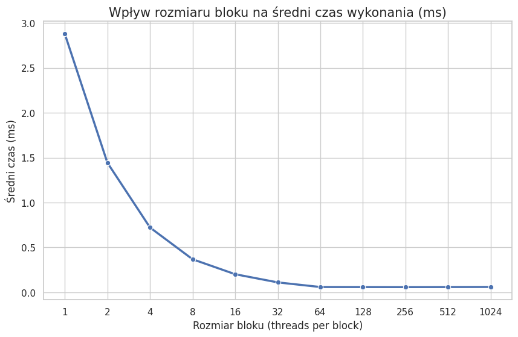
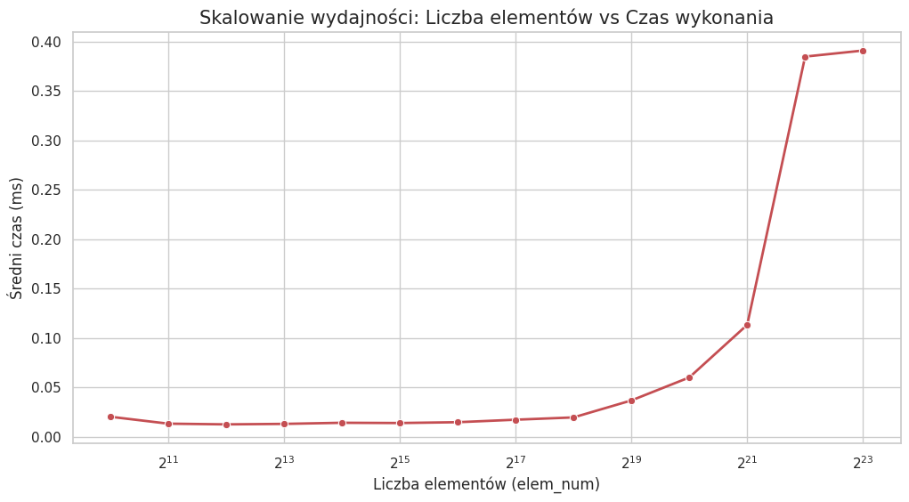

# CUDA
## Jakub Ciszewski

### Zadanie 1
Zadanie polegało na zmierzeniu średniego czasu dodania dwóch wektorów dla różnych rozmiarów bloków.

Kod programu mierzącego średni czas dodania 2 wektorów w zależności od liczby wątków w bloku.

```cpp
#include <stdio.h>
#include <stdlib.h>

#define N 1048576
#define REPETITIONS 20

void host_add(int *a, int *b, int *c) {
    for(int idx=0; idx<N; idx++)
        c[idx] = a[idx] + b[idx];
}

__global__ void device_add(int *a, int *b, int *c) {
    int index = threadIdx.x + blockIdx.x * blockDim.x;
    if (index < N) {
        c[index] = a[index] + b[index];
    }
}

int main(void) {
    int *a, *b, *c;
    int *d_a, *d_b, *d_c;
    int size = N * sizeof(int);

    a = (int *)malloc(size);
    b = (int *)malloc(size);
    c = (int *)malloc(size);

    for (int i = 0; i < N; i++) {
        a[i] = 3;
        b[i] = 5;
    }

    cudaMalloc((void **)&d_a, size);
    cudaMalloc((void **)&d_b, size);
    cudaMalloc((void **)&d_c, size);

    cudaMemcpy(d_a, a, size, cudaMemcpyHostToDevice);
    cudaMemcpy(d_b, b, size, cudaMemcpyHostToDevice);

    int block_sizes[] = {1, 2, 4, 8, 16, 32, 64, 128, 256, 512, 1024};
    int num_tests = sizeof(block_sizes) / sizeof(block_sizes[0]);

    printf("N = %d\n", N);
    printf("---------------------------------------------------------\n");
    printf("%-15s | %-15s | %-15s\n", "Rozmiar bloku", "Liczba bloków", "Średni czas (ms)");
    printf("---------------------------------------------------------\n");

    for (int t = 0; t < num_tests; t++) {
        int threads_per_block = block_sizes[t];
        
        int no_of_blocks = (N + threads_per_block - 1) / threads_per_block;

        float total_time = 0;
        cudaEvent_t start, stop;
        cudaEventCreate(&start);
        cudaEventCreate(&stop);

        for (int r = 0; r < REPETITIONS; r++) {
            float milliseconds = 0;
            
            cudaEventRecord(start, 0);  
            
            device_add<<<no_of_blocks, threads_per_block>>>(d_a, d_b, d_c);
            cudaDeviceSynchronize();
            
            cudaEventRecord(stop, 0);
            cudaEventSynchronize(stop);

            cudaEventElapsedTime(&milliseconds, start, stop);
            total_time += milliseconds;
        }

        float average_time = total_time / REPETITIONS;
        printf("%-15d | %-15d | %-15.4f\n", threads_per_block, no_of_blocks, average_time);

        cudaEventDestroy(start);
        cudaEventDestroy(stop);
    }

    cudaMemcpy(c, d_c, size, cudaMemcpyDeviceToHost);

    free(a); free(b); free(c);
    cudaFree(d_a); cudaFree(d_b); cudaFree(d_c);

    return 0;
}
```

Wynik powyższego programu
```txt
N = 1048576
---------------------------------------------------------
Rozmiar bloku   | Liczba bloków  | Średni czas (ms)
---------------------------------------------------------
1               | 1048576         | 2.8785         
2               | 524288          | 1.4437         
4               | 262144          | 0.7224         
8               | 131072          | 0.3687         
16              | 65536           | 0.2021         
32              | 32768           | 0.1110         
64              | 16384           | 0.0595         
128             | 8192            | 0.0590         
256             | 4096            | 0.0584         
512             | 2048            | 0.0592         
1024            | 1024            | 0.0601         
```

Wykres przedstawiający czas wykonania programu w zależności od liczby wątków w bloku. 


Na wykresie ciężko dopatrzeć się minimum. Dochodzi jedynie do wypłaszczenia wykresu od rozmiaru bloku wynoszącego 64.
Na wykresie została użyta skala logarytmiczna o podstawie 2 na osi X w celu poprawienia czytelności.


### Zadanie 2
Zadanie polegało na zmierzeniu średniego czasu dodania 2 wektorów dla stałej liczby wątków w bloku i różnych rozmiarów wektorów.

Kod programu obliczającego średni czas dodania dwóch wektorów w zależności od wielkości wektorów.

```cpp
#include <stdio.h>
#include <stdlib.h>

#define REPETITIONS 20
#define BLOCK_SIZE 256

__global__ void device_add(int *a, int *b, int *c, int n) {
    int index = threadIdx.x + blockIdx.x * blockDim.x;
    if (index < n) {
        c[index] = a[index] + b[index];
    }
}

int main(void) {
    int powers[] = {10, 11, 12, 13, 14, 15, 16, 17, 18, 19, 20, 21, 22, 23};
    int num_tests = sizeof(powers) / sizeof(powers[0]);

    printf("Rozmiar bloku (stalv): %d\n", BLOCK_SIZE);
    printf("-----------------------------------------------------------------\n");
    printf("%-5s | %-12s | %-15s | %-15s\n", "2^x", "Liczba elem.", "Liczba bloków", "Średni czas (ms)");
    printf("-----------------------------------------------------------------\n");

    for (int t = 0; t < num_tests; t++) {
        int current_power = powers[t];
        int N = 1 << current_power;
        int size = N * sizeof(int);

        int *a = (int *)malloc(size);
        int *b = (int *)malloc(size);
        int *c = (int *)malloc(size);

        // Inicjalizacja danych
        for (int i = 0; i < N; i++) {
            a[i] = 3;
            b[i] = 5;
        }

        int *d_a, *d_b, *d_c;
        cudaMalloc((void **)&d_a, size);
        cudaMalloc((void **)&d_b, size);
        cudaMalloc((void **)&d_c, size);

        cudaMemcpy(d_a, a, size, cudaMemcpyHostToDevice);
        cudaMemcpy(d_b, b, size, cudaMemcpyHostToDevice);

        int no_of_blocks = (N + BLOCK_SIZE - 1) / BLOCK_SIZE;

        float total_time = 0;
        cudaEvent_t start, stop;
        cudaEventCreate(&start);
        cudaEventCreate(&stop);

        for (int r = 0; r < REPETITIONS; r++) {
            float milliseconds = 0;
            
            cudaEventRecord(start, 0);  
            
            device_add<<<no_of_blocks, BLOCK_SIZE>>>(d_a, d_b, d_c, N);
            cudaDeviceSynchronize();
            
            cudaEventRecord(stop, 0);
            cudaEventSynchronize(stop);

            cudaEventElapsedTime(&milliseconds, start, stop);
            total_time += milliseconds;
        }

        float average_time = total_time / REPETITIONS;
        printf("2^%-2d | %-12d | %-15d | %-15.5f\n", current_power, N, no_of_blocks, average_time);

        cudaEventDestroy(start);
        cudaEventDestroy(stop);
        cudaFree(d_a); cudaFree(d_b); cudaFree(d_c);
        free(a); free(b); free(c);
    }

    return 0;
}
```

Wynik powyższego programu
```txt
Rozmiar bloku (stalv): 256
-----------------------------------------------------------------
2^x   | Liczba elem. | Liczba bloków  | Średni czas (ms)
-----------------------------------------------------------------
2^10 | 1024         | 4               | 0.02028        
2^11 | 2048         | 8               | 0.01328        
2^12 | 4096         | 16              | 0.01255        
2^13 | 8192         | 32              | 0.01304        
2^14 | 16384        | 64              | 0.01417        
2^15 | 32768        | 128             | 0.01392        
2^16 | 65536        | 256             | 0.01475        
2^17 | 131072       | 512             | 0.01728        
2^18 | 262144       | 1024            | 0.01960        
2^19 | 524288       | 2048            | 0.03680        
2^20 | 1048576      | 4096            | 0.06009        
2^21 | 2097152      | 8192            | 0.11333        
2^22 | 4194304      | 16384           | 0.38494        
2^23 | 8388608      | 32768           | 0.39106        
```

Wykres przedstawiający średni czas wykonania programu w zależności od rozmiaru problemu.


Tutaj na osi X również użyto skali logarytmicznej o podstawie 2 w celu poprawienia czytelności.

### Zadanie 3
Zadanie polegało na sprawdzeniu poprawności obliczeń programu z zadania 2 oraz sprawdzenia co się stanie, w przypadku gdy liczba wątków w bloku przekroczy liczbe 1024.

Kod programu
```cpp
#include <stdio.h>
#include <stdlib.h>

#define N 1048576
#define REPETITIONS 5

__global__ void device_add(int *a, int *b, int *c, int n) {
    int index = threadIdx.x + blockIdx.x * blockDim.x;
    if (index < n) {
        c[index] = a[index] + b[index];
    }
}

bool verify_results(int *a, int *b, int *c, int n) {
    for (int i = 0; i < n; i++) {
        if (c[i] != a[i] + b[i]) {
            printf("  [BŁĄD] Indeks %d: oczekiwano %d, otrzymano %d\n", i, a[i] + b[i], c[i]);
            return false;
        }
    }
    return true;
}

int main(void) {
    int size = N * sizeof(int);
    int *a = (int *)malloc(size);
    int *b = (int *)malloc(size);
    int *c = (int *)malloc(size);

    // Inicjalizacja (3 + 5 = 8)
    for (int i = 0; i < N; i++) {
        a[i] = 3;
        b[i] = 5;
    }

    int *d_a, *d_b, *d_c;
    cudaMalloc((void **)&d_a, size);
    cudaMalloc((void **)&d_b, size);
    cudaMalloc((void **)&d_c, size);

    int block_sizes[] = {256, 1024, 1025, 2048};
    int num_tests = sizeof(block_sizes) / sizeof(block_sizes[0]);

    printf("Rozpoczynanie testu poprawności dla N = %d...\n\n", N);

    for (int t = 0; t < num_tests; t++) {
        int threads_per_block = block_sizes[t];
        int no_of_blocks = (N + threads_per_block - 1) / threads_per_block;

        cudaMemset(d_c, 0, size);
        cudaMemcpy(d_a, a, size, cudaMemcpyHostToDevice);
        cudaMemcpy(d_b, b, size, cudaMemcpyHostToDevice);

        printf("Test dla bloku = %d (Liczba bloków: %d):\n", threads_per_block, no_of_blocks);

        device_add<<<no_of_blocks, threads_per_block>>>(d_a, d_b, d_c, N);
        cudaDeviceSynchronize();

        cudaError_t err = cudaGetLastError();
        if (err != cudaSuccess) {
            printf("  [CUDA ERROR] Jądro nie uruchomiło się! Powód: %s\n", cudaGetErrorString(err));
        }

        cudaMemcpy(c, d_c, size, cudaMemcpyDeviceToHost);

        if (verify_results(a, b, c, N) && err == cudaSuccess) {
            printf("  [STATUS] WYNIK POPRAWNY V\n");
        } else {
            printf("  [STATUS] WYNIK BŁĘDNY X\n");
        }
        printf("--------------------------------------------------\n");
    }

    cudaFree(d_a); cudaFree(d_b); cudaFree(d_c);
    free(a); free(b); free(c);
    return 0;
}
```

Wynik programu
```txt
Rozpoczynanie testu poprawności dla N = 1048576...

Test dla bloku = 256 (Liczba bloków: 4096):
  [STATUS] WYNIK POPRAWNY V
--------------------------------------------------
Test dla bloku = 1024 (Liczba bloków: 1024):
  [STATUS] WYNIK POPRAWNY V
--------------------------------------------------
Test dla bloku = 1025 (Liczba bloków: 1024):
  [CUDA ERROR] Jądro nie uruchomiło się! Powód: invalid configuration argument
  [BŁĄD] Indeks 0: oczekiwano 8, otrzymano 0
  [STATUS] WYNIK BŁĘDNY X
--------------------------------------------------
Test dla bloku = 2048 (Liczba bloków: 512):
  [CUDA ERROR] Jądro nie uruchomiło się! Powód: invalid configuration argument
  [BŁĄD] Indeks 0: oczekiwano 8, otrzymano 0
  [STATUS] WYNIK BŁĘDNY X
--------------------------------------------------
```

Maksymalna liczba wątków w bloku na badanym urządzeniu wynosi 1024. Podczas próby przekroczenia tego limitu otrzymujemy błąd konfiguracji. Dla poprawnych konfiguracji, czyli takich, w których liczba wątków w bloku <=1024 wyniki są poprawne.